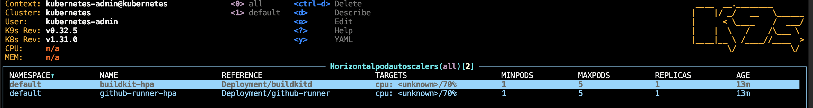
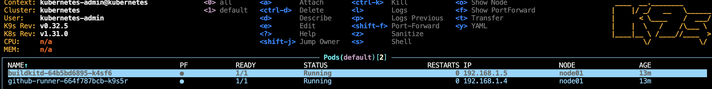

# workflows
test workflow

- using self hosted arc runners
- using buildkit running on separate container

- both can scale up using hpa

---

Considerations:

- Persistence: If you need persistent storage for BuildKit, consider adding a persistent volume claim.

- Node Selection: If you have specific nodes that are better suited for running BuildKit (e.g., nodes with more CPU or faster storage), consider adding node affinity rules.

- Monitoring: Consider setting up monitoring and logging for the BuildKit daemon to help troubleshoot any issues that may arise during builds.
